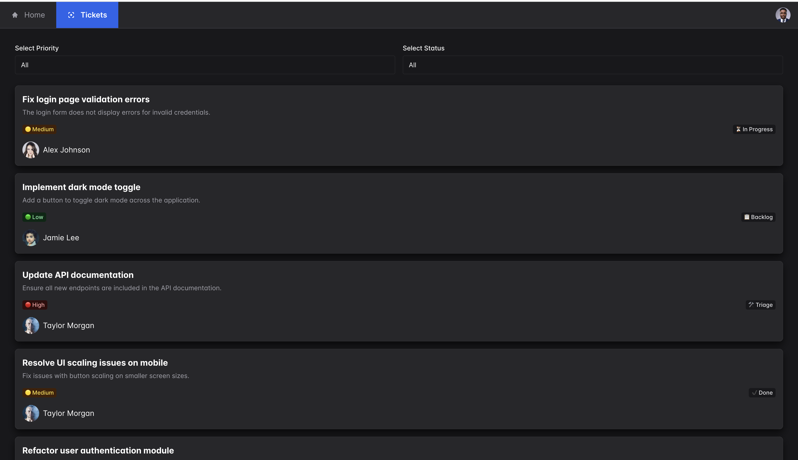

# 🎟️ Ticketing System Frontend

Welcome to the **Ticketing System Frontend**, a project I developed to showcase a simple ticket management system with essential features for ticket organization and handling.

---

## ✨ Features

- **Dynamic Ticket Listing**: Displays tickets in a visually organized manner.
- **Filterable UI**: Filter tickets based on specific criteria.
- **Responsive Design**: Ensures a seamless user experience across devices.
- **Color Modes**: Toggle between light and dark modes for accessibility and user preference.

---

## 📂 Project Structure

The project is structured for clarity and scalability:

```
src/
├── assets/          # Static assets like images or fonts
├── components/      # Reusable UI components
│   ├── Avatar/
│   ├── FilterBar/
│   ├── Layout/
│   ├── TicketCard/
│   └── TicketList/
├── context/         # Context providers (e.g., theme, color mode)
├── data/            # Static or mock data
├── hooks/           # Custom hooks
├── pages/           # Page components (e.g., TicketsPage)
├── types/           # TypeScript types
└── utils/           # Utility functions
```

---

## 🚀 Getting Started

### Prerequisites

- [Node.js](https://nodejs.org/) installed on your machine.

### Steps to Run

1. Install dependencies:

   ```bash
   npm i
   ```

2. Run the application:

   ```bash
   npm run dev
   ```

3. Open your browser and navigate to [http://localhost:3000](http://localhost:3000).

---

## 🛠 Technologies Used

- **React** with **TypeScript** for building the UI.
- **Vite** for fast bundling and development.
- **ChakraUI** for styling.
- **ESLint** and **Prettier** for code linting and formatting.

---

## 📋 Future Improvements

- Include advanced **filtering and sorting** options for tickets.
- Add loadings for fetching async data.
- Add **unit and integration tests** for better reliability.

---

## Screenshots

### 1. Tickets Page



---

## 📝 Notes

This project is a demonstration of my ability to create a frontend application from scratch. I’ve focused on making the codebase scalable and easy to understand.

---

## 📬 Contact Me

If you have any feedback or questions, feel free to reach out:

- 💼 [LinkedIn](https://www.linkedin.com/in/yaroslav-matushevych)
- 📧 yaroslav.matushevych@gmail.com

---

### 🙌 Thank You!

Thank you for exploring this project! I hope you enjoy working with it as much as I did building it. 😊
